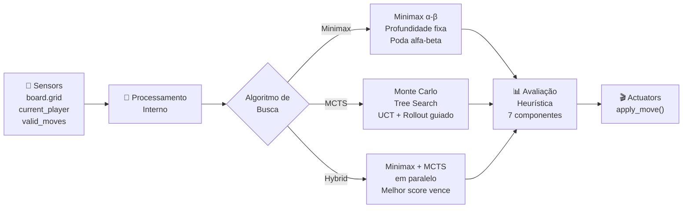
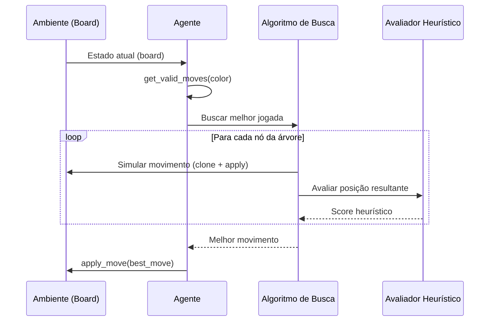

# Modelagem PEAS e Arquitetura do Agente

## Integrantes do Projeto

| Matrícula | Nome |
|---|---|
| 20250041045 | Antonionne Coelho Paulino |
| 20180144499 | Cristian Deyves Oliveira de Brito |
| 20200146530 | João Gilberto Rocha de Sousa |
| 20200118115 | Ronaldo Tomaz de Aquino Junior |

---

## Modelagem PEAS

A modelagem **PEAS** (Performance, Environment, Actuators, Sensors) é uma
ferramenta proposta por Russell & Norvig para descrever formalmente o problema
que um agente inteligente deve resolver. Abaixo detalhamos cada componente para
o agente de damas implementado neste projeto.

### Performance (Medida de Desempenho)

A medida de desempenho avalia quão bem o agente cumpre seu objetivo — vencer a
partida de damas. Os indicadores utilizados são:

| Métrica | Descrição | Implementação |
|---|---|---|
| **Taxa de vitória** | Percentual de partidas vencidas contra o oponente | `MetricsCollector.get_win_rate()` |
| **Tempo médio por jogada** | Tempo (em segundos) gasto para decidir cada movimento | `MetricsCollector.get_average_time_per_move()` |
| **Estados analisados** | Quantidade de nós da árvore de busca explorados por decisão | `agent.states_analyzed` |
| **Eficiência de capturas** | Proporção de jogadas que resultam em captura de peças adversárias | Calculado via `move.captured_positions` |
| **Número de jogadas até vencer** | Menor número de turnos necessários para encerrar a partida | Registrado em `MetricsCollector.matches` |

### Environment (Ambiente)

O jogo de damas constitui o ambiente no qual o agente opera.

| Propriedade | Classificação | Justificativa |
|---|---|---|
| **Observabilidade** | Totalmente observável | O agente tem acesso completo ao estado do tabuleiro 8×8; não há informação oculta |
| **Determinismo** | Determinístico | Cada movimento produz um único estado resultante, sem aleatoriedade |
| **Episodicidade** | Sequencial | As decisões atuais afetam todas as futuras; cada jogada altera o estado do tabuleiro |
| **Dinamicidade** | Estático | O ambiente não muda enquanto o agente delibera; o oponente aguarda sua vez |
| **Continuidade** | Discreto | Número finito de estados, ações e percepções possíveis |
| **Número de agentes** | Multiagente competitivo | Dois jogadores com objetivos opostos disputam a mesma partida |
| **Conhecimento** | Conhecido | As regras do jogo são completamente conhecidas pelo agente |

**Representação do ambiente:**

- Tabuleiro 8×8 representado como matriz `grid[8][8]`
- Cada célula pode conter: `None`, `"BLACK"`, `"WHITE"`, `"BLACK_KING"`, `"WHITE_KING"`
- Turno alternado controlado por `board.current_player`

### Actuators (Atuadores)

Os atuadores são as ações que o agente pode executar no ambiente:

| Atuador | Descrição | Implementação |
|---|---|---|
| **Movimento simples** | Mover uma peça uma casa na diagonal (para frente) | `Move(start_pos, end_pos, captured_positions=[], is_promotion=False)` |
| **Captura simples** | Saltar sobre uma peça adversária adjacente, removendo-a | `Move(..., captured_positions=[(r,c)], captured_pieces=[...])` |
| **Captura múltipla** | Encadear duas ou mais capturas em um único turno | `Move(..., captured_positions=[(r1,c1), (r2,c2), ...])` |
| **Promoção a dama** | Ao atingir a última fileira, a peça é promovida a rei | `Move(..., is_promotion=True)` |

**Regra de captura obrigatória:** quando há capturas disponíveis, o agente é
obrigado a capturar (apenas movimentos de captura são retornados por
`get_valid_moves`).

### Sensors (Sensores)

Os sensores fornecem ao agente informações sobre o estado do ambiente:

| Sensor | Informação fornecida | Acesso no código |
|---|---|---|
| **Estado do tabuleiro** | Matriz 8×8 com todas as peças e suas posições | `board.grid` |
| **Jogador atual** | Qual cor deve jogar neste turno | `board.current_player` |
| **Movimentos válidos** | Lista de todos os movimentos legais para a cor atual | `board.get_valid_moves(color)` |
| **Detecção de fim de jogo** | Se o jogo terminou (vitória, derrota ou empate) | `board.is_terminal()`, `game.is_draw()` |
| **Contagem de peças** | Número de peças de cada cor no tabuleiro | `rules.count_pieces(grid, color)` |
| **Identificação de peças** | Tipo de cada peça (normal ou rei) | `rules.is_king(piece)` |

---

## Arquitetura do Agente

Os agentes deste projeto seguem a arquitetura de **agente baseado em modelo
com busca**. Cada agente mantém uma representação interna do estado (o
tabuleiro), gera estados futuros por simulação, e seleciona a ação que
maximiza uma função de avaliação.

### Fluxo de decisão do agente

---

## Comparação dos Agentes

| Característica | Minimax α-β | MCTS UCT | Hybrid |
|---|---|---|---|
| **Tipo de busca** | Busca adversarial com poda | Busca estocástica por amostragem | Combinação paralela |
| **Completude** | Completa até a profundidade `d` | Assintoticamente completa | Combina ambos |
| **Parâmetro principal** | Profundidade (`depth`) | Iterações (`iterations`) | Ambos |
| **Avaliação** | Heurística nos nós folha | Rollout guiado + heurística | Heurística para desempate |
| **Exploração vs Explotação** | Poda α-β elimina ramos ruins | UCT balanceia via constante `C` | MCTS explora, Minimax explota |
| **Complexidade de tempo** | O(b^d) com poda | O(iterações × profundidade rollout) | O(max(Minimax, MCTS)) |
| **Paralelismo** | `MinimaxAgentParallel` | `MCTSAgentParallel`, `MCTSAgentProcess` | ThreadPoolExecutor (2 workers) |
| **Melhor cenário** | Poucos movimentos, árvore estreita | Árvore larga, muitos empates | Situações ambíguas |

### Heurística de Avaliação (7 componentes)

A função de avaliação (`BoardEvaluator.evaluate`) combina sete fatores
ponderados para estimar a qualidade de uma posição:

| Componente | Peso | Descrição |
|---|---|---|
| **Material** | 10.0 | Diferença de peças (peão=1.0, rei=2.5) |
| **Mobilidade** | 1.5 | Diferença de movimentos válidos disponíveis |
| **Posição** | 1.5 | Valor posicional (centro, avanço, back row) |
| **Reis** | 5.0 | Valor adicional por reis no tabuleiro |
| **Potencial de captura** | 3.5 | Capturas disponíveis (bônus para multi-captura) |
| **Potencial de promoção** | 2.0 | Proximidade de peões à linha de promoção |
| **Segurança** | 1.0 | Peças com suporte aliado na diagonal traseira |

Adicionalmente, um **bônus de tempo** (±0.3) favorece o jogador com o turno.

---

## Classificação segundo Russell & Norvig

Seguindo a taxonomia de ambientes de tarefas do livro *Artificial Intelligence:
A Modern Approach* (Russell & Norvig):

> O jogo de damas é um ambiente **totalmente observável**, **determinístico**,
> **sequencial**, **estático**, **discreto** e **multiagente competitivo** com
> regras **conhecidas**. O espaço de estados é finito (estimado em ~5×10²⁰
> posições) e a árvore de jogo tem fator de ramificação médio ~10.

Essa classificação justifica o uso de algoritmos de busca adversarial (Minimax)
e métodos de amostragem (MCTS), que são as técnicas clássicas para esse tipo
de ambiente.
